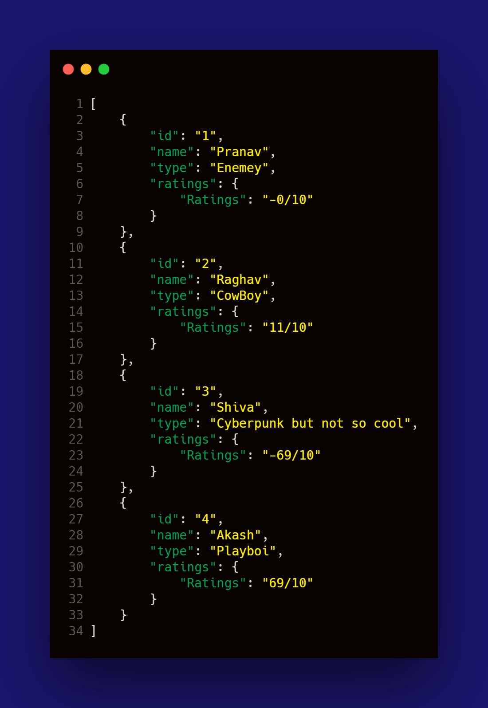

# Golang Rest API

### Friends List lolxD

CheckList:

- [x] Static

## Run

```
# This project uses Denon
go build && ./friendsapi.exe
```

## Working



## Routes

```
GET      /api/friends 
GET      /api/friend/:id
POST     /api/friends/ 
PUT      /api/friend/:id
DELETE   /api/friend/:id
```
